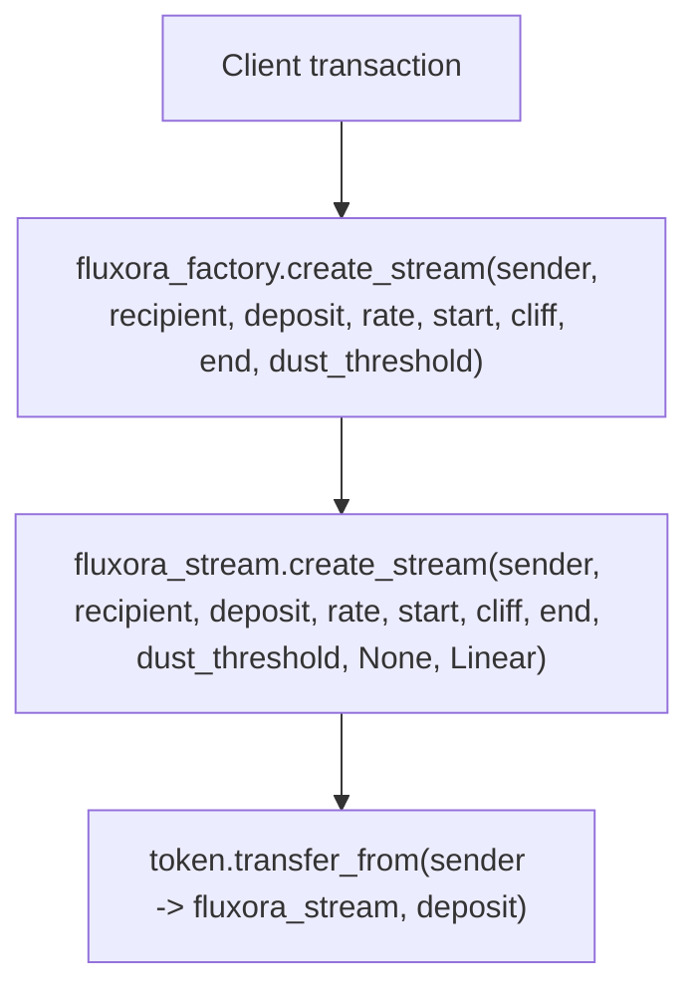

# Treasury Policy Factory Contract

The `fluxora_factory` contract is an optional wrapper around `FluxoraStream` designed specifically to enforce treasury compliance policies during stream creation.

## Overview

The base `FluxoraStream` contract is highly composable and intentionally un-opinionated about things like maximum stream sizes, minimum durations, and recipient identities. This makes it ideal as a protocol primitive. However, treasuries managing large token reserves often require strict operational policies. 

The `fluxora_factory` acts as a proxy entrypoint to enforce these policies:
- **Recipient Allowlist**: Streams can only be created for recipients explicitly allowlisted by the admin.
- **Deposit Caps**: Enforces a `MaxDepositCap` on the total `deposit_amount` of a single stream.
- **Minimum Duration**: Enforces a `MinDuration` (i.e. `end_time - start_time >= min_duration`), preventing overly short or instantaneous streams.
- **Time Relationship Checks**: Rejects invalid schedules before calling `FluxoraStream`. `start_time` must be strictly less than `end_time`, and `cliff_time` must be within the inclusive `[start_time, end_time]` window.

## Time Validation

The factory mirrors the underlying stream contract's creation-time schedule invariants and returns typed factory errors before making the cross-contract call:

| Condition | Error |
|-----------|-------|
| `start_time >= end_time` | `FactoryError::InvalidTimeRange` |
| `cliff_time < start_time` | `FactoryError::InvalidCliff` |
| `cliff_time > end_time` | `FactoryError::InvalidCliff` |

These checks keep invalid treasury requests on the factory error surface instead of relying on downstream stream-contract panics.

## Read-Only Views

The factory exposes read-only views so UIs, operators, and indexers can inspect policy before routing treasury activity through the wrapper.

| View | Returns | Notes |
|------|---------|-------|
| `get_factory_config()` | `FactoryConfig { admin, stream_contract, max_deposit, min_duration }` | Reads all instance policy fields. Returns `FactoryError::NotInitialized` before `init`. |
| `is_allowlisted(recipient)` | `bool` | Returns `true` only when the recipient currently has an allowlist entry. Missing entries return `false`. |

These views are permissionless and do not mutate factory state.

## Important Bypass Warning

> [!WARNING]
> Because the underlying `FluxoraStream` contract does not natively enforce these policies, **they are only enforced if the stream is created by routing through the factory contract.** 
> 
> If a user (e.g. the treasury multi-sig itself) directly calls `create_stream` on the `FluxoraStream` contract, these policies will be bypassed. To truly lock down treasury funds, the token vault or multi-sig must be configured to *only* approve transactions that invoke the `fluxora_factory` contract.

## Architecture & CEI

The factory contract follows the Checks-Effects-Interactions (CEI) pattern implicitly:
1. **Checks**: Validates the recipient against the allowlist, validates the stream time relationship, and bounds the deposit and duration against the configured caps.
2. **Effects**: No local persistent state changes occur during a successful stream creation.
3. **Interactions**: Makes a cross-contract call to `FluxoraStream::create_stream`.

## Cross-contract authorization model

Factory-routed creation has one client-facing entrypoint, but the sender authorization
must cover both the wrapper call and the nested stream call:



The required authorization scopes are:

| Signer | Scope | Why it is required |
| --- | --- | --- |
| `sender` | `fluxora_factory.create_stream(...)` with the exact wrapper arguments | `FluxoraFactory::create_stream` calls `sender.require_auth()` after policy checks pass. |
| `sender` | Nested `fluxora_stream.create_stream(...)` with the exact stream arguments the factory forwards | `FluxoraStream::create_stream` also calls `sender.require_auth()` before validating and pulling the deposit. |

This is not two independent user intents. A client should build the Soroban
authorization tree so the `sender` signs the factory invocation and its
`fluxora_stream.create_stream` sub-invocation in the same transaction. The nested
scope is intentionally narrow: it authorizes only the exact stream creation that
the factory forwards after enforcing recipient, cap, and duration policy.

The stream contract, not the factory, pulls `deposit_amount` from `sender` into
the stream contract during `fluxora_stream.create_stream`. The factory never
custodies the sender's tokens and has no standing privilege to spend sender
funds. If a later transaction tries to reuse the factory or a changed set of
arguments, the sender must authorize that new invocation tree again.

### Worked client-signing example

Assume a treasury UI wants to create this routed stream:

```text
sender = G_SENDER
recipient = G_RECIPIENT
deposit_amount = 1_000
rate_per_second = 1
start_time = 1_800_000_000
cliff_time = 1_800_000_000
end_time = 1_800_001_000
withdraw_dust_threshold = 0
```

The client prepares a transaction whose root host function invokes
`fluxora_factory.create_stream` with those values. During simulation/preparation,
the authorization tree must contain `G_SENDER` for the root factory call and the
nested `fluxora_stream.create_stream` sub-invocation with:

```text
memo = None
kind = Linear
```

`G_SENDER` signs that prepared authorization tree. The factory admin does not
sign stream creation unless the admin is also the `sender`. The recipient does
not sign creation. The recipient signs only later recipient-controlled actions
such as `withdraw` or `withdraw_to`.

### Single-auth vs dual-scope auth

For UI and wallet copy, describe the flow as "one sender signing session with two
scopes" rather than "two unrelated signatures":

1. The factory scope lets the sender opt into the treasury policy wrapper.
2. The stream scope lets the stream contract create the stream and pull exactly
   the authorized deposit from the sender.

If the client omits either scope, the transaction fails at the corresponding
`require_auth` call. If the sub-invocation arguments differ from the signed
arguments, the nested authorization is not valid for that call.

## Tests and Verification

### Unit and Policy Tests
The core policy validation is heavily covered by unit tests in `contracts/stream/tests/factory_policy.rs`. These tests cover basic validation paths and standard edge cases, verifying that:
- Non-allowlisted recipients are correctly rejected.
- Deposits exceeding the configured cap are blocked, while deposits exactly at the cap are accepted.
- Durations below the minimum required duration are rejected, while durations exactly at the minimum are accepted.
- Start and end time limits (such as `start_time >= end_time`) are strictly validated.
- Proper administration privileges are required for setter methods.

### Randomized Property-Based Fuzz Harness
To uncover edge cases and guard against boundary checks or logical bypasses, a comprehensive property fuzzing harness is implemented in `contracts/stream/tests/factory_fuzz.rs` using `proptest`.

This harness systematically generates and evaluates randomized variations of:
- `max_deposit` (cap) and fuzzed `deposit_offset` (testing values below, exactly at, and above the cap).
- `min_duration` and fuzzed `duration_offset` (testing values below, exactly at, and above the minimum duration).
- Randomized recipient allowlist states.
- Randomized `start_time` and time-bounds.

#### Properties Asserted (iff Semantic Verification)
Exactly the following logical invariants are verified to hold for every execution of the fuzz harness:
1. **RecipientNotAllowlisted iff !is_allowlisted**: A request must fail with `RecipientNotAllowlisted` if and only if the recipient is not currently allowlisted, regardless of other parameters.
2. **DepositExceedsCap iff deposit > cap**: If the recipient is allowlisted, the stream creation fails with `DepositExceedsCap` if and only if the deposit amount exceeds the configured policy cap.
3. **InvalidTimeRange iff start >= end**: If the recipient is allowlisted and the deposit is within the cap, the stream creation fails with `InvalidTimeRange` if and only if the start time is greater than or equal to the end time.
4. **DurationTooShort iff duration < min_duration**: If the recipient is allowlisted, the deposit is within the cap, and the time range is valid, the stream creation fails with `DurationTooShort` if and only if the duration is strictly less than the minimum duration.
5. **No false-rejections**: Any valid in-policy input combination must succeed without error, guaranteeing that no correct transaction is wrongly blocked.

To execute the fuzzing harness, run:
```bash
cargo test --test factory_fuzz
```

## Admin Controls

The factory has an `Admin` key managed via `set_admin`. The admin can:
- Call `set_allowlist` to grant or revoke recipient eligibility.
- Call `set_cap` to update the max deposit limit.
- Call `set_min_duration` to update the minimum duration requirement.
- Call `set_stream_contract` to upgrade or switch the underlying stream primitive if a new version is deployed.

The factory admin can shape policy and the target stream contract, but cannot
spend sender funds by itself. A factory-routed stream still needs the `sender`
authorization described above, and the underlying stream contract still enforces
its own authorization table. See the [`docs/security.md` admin powers
section](security.md#admin-powers) for the protocol-wide admin boundary.

## Downstream error mapping

The factory uses `FluxoraStreamClient::try_create_stream` instead of the
panicking `.create_stream()` to catch downstream `ContractError` variants and
return structured `FactoryError` codes. This ensures factory callers never
receive a host trap from expected downstream failures.

| Downstream `ContractError` | Factory `FactoryError` | Description |
|---|---|---|
| `ContractPaused` (creation paused or global emergency pause) | `StreamContractPaused` | Stream creation is blocked by the downstream contract. Callers can retry after the pause is lifted. |
| Any other `ContractError` variant | `StreamContractError` | Catch-all for downstream rejections (e.g. `InvalidParams`, `InsufficientDeposit`, `StartTimeInPast`). The factory preserves fail-closed semantics — no downstream error is masked as success. |
| Host-level error (panic/trap) | `StreamContractError` | If the cross-contract invocation itself fails at the host level (e.g. contract does not exist), it is also mapped to the catch-all error. |

**Security note**: The mapping deliberately **never** converts a downstream
failure into a success. `ContractPaused` is given a dedicated variant because
it represents a recoverable administrative state; all other errors collapse
into the catch-all to avoid leaking internal stream-contract error codes
through the factory boundary.

## Code alignment checklist

This document is aligned with the current implementation as follows:

- `FluxoraFactory::create_stream` enforces allowlist, cap, and duration checks
  before calling `sender.require_auth()`.
- The factory forwards a linear `FluxoraStream::create_stream` call with
  `memo = None` and `StreamKind::Linear`.
- `FluxoraStream::create_stream` calls `sender.require_auth()` before validating
  parameters and pulling `deposit_amount` from `sender`.
- `contracts/stream/tests/factory_policy.rs` covers the factory policy gates,
  downstream error mapping, and admin-guarded policy updates that surround this
  authorization model.

---

## Emergency Pause (Kill Switch)

The factory exposes an admin-controlled pause mechanism that blocks all new stream
creation without requiring any changes to the allowlist or policy state.

### Motivation

When an incident occurs (e.g., a bug in the underlying stream contract, a policy
misconfiguration, or an active exploit), the admin previously had no fast path to
stop new factory-originated streams. The only option was to iteratively remove
every allowlisted recipient — a destructive, slow operation that leaves the
incident window open.

The `CreationPaused` flag closes this gap: a single admin transaction halts all
creation, and a second transaction resumes normal operation once the incident is
resolved.

### New storage key

| Key | Type | Storage tier | Default |
|-----|------|-------------|---------|
| `DataKey::CreationPaused` | `bool` | `instance` | `false` (absent = unpaused) |

The key is omitted from storage on `init`. `is_factory_paused` falls back to
`false` on a missing entry, so existing deployments are unaffected by the upgrade.

### New entrypoints

#### `set_factory_paused(env, paused: bool) -> Result<(), FactoryError>`

Toggle the creation pause.

- Requires the stored admin's `require_auth`.
- Returns `FactoryError::NotInitialized` when called before `init`.
- Emits a `(factory, paused)` event with payload `true` when pausing, or a
  `(factory, resumed)` event with payload `false` when resuming.
- Idempotent: calling `set_factory_paused(true)` twice is safe.

#### `is_factory_paused(env) -> bool`

Permissionless view that returns the current value of `CreationPaused`
(`false` when the key is absent). Intended for UI pre-flight and monitoring.

### Guard order in `create_stream`

The pause guard is inserted as the **first check** — before any policy read:

```
1. CreationPaused → FactoryError::CreationPaused   (before allowlist / cap reads)
2. Allowlist check
3. Deposit cap check
4. Time-range invariants
5. Minimum-duration check
6. sender.require_auth()
7. Cross-contract stream creation
```

Checking the pause flag before policy reads prevents leaking allowlist membership
or cap values to an attacker probing state during an active incident.

### Events

| Topic tuple | Payload | When emitted |
|-------------|---------|--------------|
| `(symbol!("factory"), symbol!("paused"))` | `true` | Admin sets `paused = true` |
| `(symbol!("factory"), symbol!("resumed"))` | `false` | Admin sets `paused = false` |

### Security assumptions

1. **Only the stored admin can toggle the flag.** `require_admin` is the single
   authorization chokepoint; see `contracts/factory/src/lib.rs`.
2. **No bypass via direct stream calls.** The pause only applies to
   `FluxoraFactory::create_stream`. Callers who invoke `FluxoraStream::create_stream`
   directly bypass all factory policies. Operators must restrict the underlying
   stream contract as described in the [Bypass Warning](#important-bypass-warning)
   section above.
3. **Pause state survives admin rotation.** `DataKey::CreationPaused` is an
   independent instance entry; rotating the admin via `set_admin` does not reset
   the pause flag.
4. **Pause blocks creation, not withdrawal.** Active streams already in flight
   are unaffected. Recipients can still withdraw from existing streams; senders
   can still cancel or modify existing streams.

### Operator runbook

**Pause creation during an incident:**

```bash
# Build and sign the pause transaction
soroban contract invoke \
  --id <FACTORY_CONTRACT_ID> \
  --source <ADMIN_SECRET_KEY> \
  -- set_factory_paused --paused true
```

**Verify the flag:**

```bash
soroban contract invoke \
  --id <FACTORY_CONTRACT_ID> \
  --source <ANY_ACCOUNT> \
  -- is_factory_paused
# Returns: true
```

**Resume after the incident is resolved:**

```bash
soroban contract invoke \
  --id <FACTORY_CONTRACT_ID> \
  --source <ADMIN_SECRET_KEY> \
  -- set_factory_paused --paused false
```

### Code alignment checklist

- `DataKey::CreationPaused` is declared in `contracts/factory/src/lib.rs`.
- `set_factory_paused` and `is_factory_paused` are implemented in the same file.
- `create_stream` checks `CreationPaused` as its **first guard** before any
  policy read.
- `contracts/stream/tests/factory_policy.rs` covers:
  - Default unpause state after `init`
  - Pause/resume toggle reflected by `is_factory_paused`
  - Idempotent pause and resume
  - `create_stream` rejected with `CreationPaused` when paused
  - Pause checked before allowlist (no state leak)
  - Pause checked before cap (no state leak)
  - `create_stream` succeeds (past the pause guard) after resume
  - Non-admin toggle panics
  - `set_factory_paused` before `init` returns `NotInitialized`
  - Full pause → resume → pause toggle cycle
