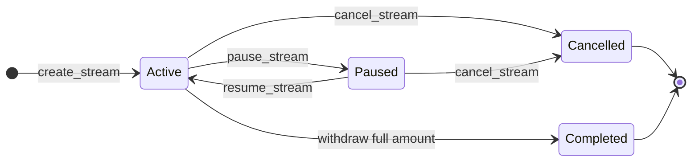
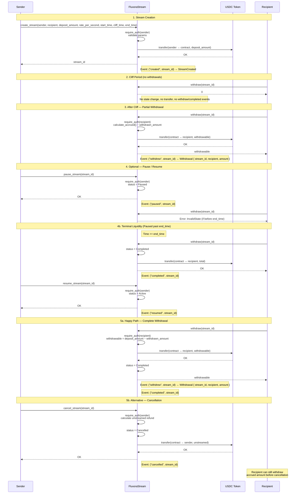

# Fluxora Stream Contract Documentation

Onboarding and integration reference for developers and auditors. Describes stream lifecycle, accrual formula, cliff/end_time behavior, access control, events, and error codes.

**Source of truth:** `contracts/stream/src/lib.rs`, `contracts/stream/src/accrual.rs`

**Alignment verification:** See [protocol-narrative-code-alignment.md](./protocol-narrative-code-alignment.md) for complete mapping between this documentation and implementation.

## Sync Checklist

When changing the contract:

- Update this doc if you change lifecycle, access control, events, or error semantics
- Update `protocol-narrative-code-alignment.md` to reflect changes
- Run `cargo test -p fluxora_stream` before committing
- Update snapshot tests if externally visible behavior changes
- No behavior change required for doc-only updates

**Entrypoint index (validator):** `batch_withdraw_to`, `delete_stream_template`, `get_global_emergency_paused`, `get_recipient_stream_count`, `get_stream_memo`, `get_stream_template`, `global_resume`, `set_contract_paused`, `set_global_emergency_paused`, `version`.

## Externally Visible Assurances

This document provides crisp success and failure semantics for all protocol operations. Treasury operators, recipient applications, and auditors can reason about contract behavior using only:

1. **On-chain observables**: Persistent storage fields, emitted events, token transfers
2. **Published documentation**: This file and referenced specifications
3. **Error classifications**: Structured `ContractError` variants

No hidden rules or implementation details are required to understand protocol behavior.

### Schedule templates (presets)

From **CONTRACT_VERSION 3**, integrators can register **relative** schedule skeletons (`register_stream_template`) and create streams from them (`create_stream_from_template`). This standardizes recurring payroll windows and trims repeated calldata versus always passing `start_delay` / `cliff_delay` / `duration` through the client for identical shapes.

- **Auth**: registering and deleting templates requires the template `owner` signer. Creating a stream from a template requires the **funding `sender`** to authorize (same as `create_stream_relative`).
- **Caps**: per-owner and global template counts are bounded; see `MAX_TEMPLATES_PER_OWNER` and `MAX_GLOBAL_TEMPLATES` in `contracts/stream/src/lib.rs`.
- **Errors**: `TemplateNotFound`, `TemplateLimitExceeded`, `TemplateUnauthorized`.

---

## 1. Stream Lifecycle

### Phases

| Phase            | Action                                     | Notes                                                                   |
| ---------------- | ------------------------------------------ | ----------------------------------------------------------------------- |
| **Creation**     | `create_stream`                            | Sender deposits tokens; stream starts as `Active`                       |
| **Pause**        | `pause_stream` / `pause_stream_as_admin`   | Stops withdrawals; accrual continues by time                            |
| **Resume**       | `resume_stream` / `resume_stream_as_admin` | Restores withdrawals                                                    |
| Phase            | Action                                     | Notes                                                                   |
| ---------------- | ------------------------------------------ | ----------------------------------------------------------------------- |
| **Creation**     | `create_stream`                            | Sender deposits tokens; stream starts as `Active`                       |
| **Pause**        | `pause_stream` / `pause_stream_as_admin`   | Stops withdrawals; accrual continues by time                            |
| **Resume**       | `resume_stream` / `resume_stream_as_admin` | Restores withdrawals                                                    |
| **Cancellation** | `cancel_stream` / `cancel_stream_as_admin` | Refunds unstreamed amount to sender; accrued amount stays for recipient |
| **Withdrawal**   | `withdraw` / `withdraw_to` / `batch_withdraw` / `delegated_withdraw` | Recipient pulls accrued tokens (directly or via relayer) |
| **Completion**   | Automatic                                  | When `withdrawn_amount == deposit_amount`, status becomes `Completed`   |
| **Withdrawal**   | `withdraw` / `withdraw_to` / `batch_withdraw` / `delegated_withdraw` | Recipient pulls accrued tokens (directly or via relayer) |
| **Completion**   | Automatic                                  | When `withdrawn_amount == deposit_amount`, status becomes `Completed`   |
| Phase            | Action                                        | Notes                                                                 |
| ---------------- | --------------------------------------------- | --------------------------------------------------------------------- |
| **Creation**     | `create_stream`                               | Sender deposits tokens; stream starts as `Active`                     |
| **Top-up**       | `top_up_stream`                               | Extra deposit locked (sender or admin only); schedule unchanged       |
| **Pause**        | `pause_stream` / `pause_stream_as_admin`      | Stops withdrawals; accrual continues by time                          |
| **Resume**       | `resume_stream` / `resume_stream_as_admin`    | Restores withdrawals; blocked if past `end_time` (Terminal)           |
| **Cancellation** | `cancel_stream` / `cancel_stream_as_admin`    | Refunds unstreamed amount; frozen accrued stays for recipient         |
| **Withdrawal**   | `withdraw` / `withdraw_to` / `batch_withdraw` | Recipient pulls accrued tokens; allowed on Paused if past `end_time`  |
| **Completion**   | Automatic                                     | When `withdrawn_amount == deposit_amount`, status becomes `Completed` |
| **Rotation**     | `update_recipient`                            | Recipient transfers entitlement to a new address                      |
| **Auto-claim**   | `set_auto_claim` / `revoke_auto_claim` / `trigger_auto_claim` | Recipient opts in to permissionless final claim at `end_time` to a chosen destination |

### State Transitions

- **Active** ↔ **Paused** (via pause/resume)
- **Active** or **Paused** → **Cancelled** (terminal)
- **Active** or **Paused** → **Completed** (when recipient withdraws full deposit; terminal)

Terminal states: `Completed`, `Cancelled`. Both may be closed via `close_completed_stream` to reclaim storage and index space. A stream is also considered technically terminal if `ledger.timestamp() >= end_time`.
In this "time-terminal" state, pause/resume is blocked, but withdrawal is always allowed regardless of previous pause status.

**Cancelled stream closure rule**: A `Cancelled` stream may only be closed after the recipient has fully withdrawn the frozen accrued amount. Attempting to close a `Cancelled` stream with remaining claimable balance returns `ContractError::InvalidState`. This prevents storage cleanup from destroying recipient funds.

### Cancellation Semantics (Issue Scope)

This section is the protocol-level contract for `cancel_stream` and `cancel_stream_as_admin`.

Success semantics (observable):

1. Preconditions: stream status is `Active` or `Paused`.
2. `cancelled_at` is set to current ledger timestamp.
3. Accrued amount is frozen at `cancelled_at` (no post-cancel time growth).
4. Optional cancellation fee is applied only to the unstreamed refund:
   - `refund_gross = deposit_amount - accrued_at_cancelled_at`
   - If `cancellation_fee_bps > 0`:
     - `fee = (refund_gross × cancellation_fee_bps) / 10000` (rounded down)
     - `refund_net = refund_gross - fee`
   - Else: `refund_net = refund_gross`
5. **CRITICAL**: The recipient's frozen accrued amount is **never** affected by the cancellation fee
6. Stream transitions to terminal `Cancelled` state.
7. `StreamCancelled` event is emitted with topic `("cancelled", stream_id)`.

Failure semantics (observable):

1. Missing stream: `ContractError::StreamNotFound`.
2. Non-cancellable status (`Completed` or already `Cancelled`): `ContractError::InvalidState`.
3. Modification in terminal state (past `end_time` for pause/resume): `ContractError::StreamTerminalState`.
4. Unauthorized caller on sender path: `ContractError::Unauthorized`.
5. Unauthorized caller on admin path: `ContractError::Unauthorized`.
6. Redundant state change (pause already paused): `ContractError::StreamAlreadyPaused`.
7. Redundant state change (resume already active): `ContractError::StreamNotPaused`.
8. Any failure is atomic: no refund transfer, no state mutation, no cancel event.

Role boundaries:

1. `cancel_stream`: only the stream `sender` can authorize.
2. `cancel_stream_as_admin`: only contract `admin` can authorize.
3. Recipient and third parties cannot cancel through either path unless they hold required credentials.

Invariants after successful cancellation:

1. `status == Cancelled` and `cancelled_at.is_some()`.
2. `calculate_accrued(stream_id)` always returns accrued at `cancelled_at`, unaffected by any fee.
3. `refund_net + frozen_accrued == deposit_amount - fee` (fee is burned or retained by contract)
4. `refund_net + frozen_accrued + fee == deposit_amount`.
5. Recipient may withdraw only frozen accrued remainder (`frozen_accrued - withdrawn_amount`), which is never reduced by the fee.

Cancellation Fee Guarantees:

- **Recipient protection**: The fee is always deducted from the sender's refund, never from the recipient's accrued balance.
- **Fee validation**: Valid range is 0–10000 basis points (0–100%). Creation with `cancellation_fee_bps > 10000` is rejected.
- **Fee rounding**: Calculated as `(amount × fee_bps) / 10000`, truncated down (integer division). This ensures no accidentally inflated refund.
- **Zero refund edge case**: If `refund_gross = 0` (stream fully accrued), then `fee = 0`, and sender gets no refund (as before any fee feature).

Scope boundary and exclusions:

1. In scope: refund math with optional fee, `cancelled_at` persistence/freeze semantics, cancel auth paths, cancel event consistency, recipient safety guarantee.
2. Out of scope: token-level trust assumptions beyond documented model, off-chain indexer liveness, and economic policy choices (for example who should bear operational costs or where fee proceeds go).
3. Residual risk: if a non-standard token violates SEP-41 expectations, transfer behavior may diverge; CEI ordering reduces but cannot fully eliminate external token risk.
4. Backward compat: All existing streams created with `cancellation_fee_bps = 0` behave identically to pre-fee versions.


### Global Pause Semantics (Issue Scope)

This section is the protocol-level contract for the global pause state managed via `pause_protocol` and `resume_protocol`.

**Entrypoints:**

| Function | Description |
|----------|-------------|
| `pause_protocol(admin, reason)` | Globally pause new stream creation with audit trail (reason, timestamp, admin) |
| `resume_protocol(admin)` | Globally resume new stream creation, clearing audit trail |
| `is_paused()` | Query if protocol is currently paused (permissionless) |
| `get_pause_info()` | Query detailed pause info including audit trail (permissionless) |

Success semantics (observable):

1. Preconditions: Caller must be the authorized contract `admin`.
2. Storage: The `CreationPaused` data key is set to `true` or `false` in instance storage.
3. Event: `ContractPaused(bool)` is emitted with topic `("paused_ctl",)`.
4. Effect on creation: When paused, `create_stream` and `create_streams` return `ContractError::ContractPaused` and all new stream creation is blocked.
5. Effect on existing streams: Active streams are intentionally unaffected. Withdrawals, top-ups, pause/resume/cancel operations on individual streams continue to function normally.

Failure semantics (observable):

1. Unauthorized caller on admin path: `ContractError::Unauthorized`.
2. Any failure is atomic: no storage mutation, no event emitted.

Role boundaries:

1. `pause_protocol` / `resume_protocol`: only the contract `admin` can authorize.
2. Senders and recipients cannot pause the global contract. Senders manage individual streams via `pause_stream`.

Invariants when globally paused:

1. No new streams can be persisted (no `created` events, no deposit tokens pulled).
2. Existing streams do not change status due to a global pause.
3. Audit trail (reason, timestamp, admin) is queryable via `get_pause_info()`.

Scope boundary: The global pause is strictly an administrative circuit breaker for new liabilities. It does not freeze funds of existing users or prevent recipients from withdrawing their vested entitlement.

**Note on Stream Creation:**
Stream creation is blocked while the protocol is globally paused. The `create_stream` function returns `ContractError::ContractPaused` if `is_paused()` is true. This applies to both single-stream and batch (`create_streams`) creation.



### Sequence Diagram

The following diagram shows the full create → withdraw flow, including optional pause/resume and cancel paths.



---

## 2. Accrual Formula

**Location:** `contracts/stream/src/accrual.rs`

```text
if current_time < cliff_time           → return 0
if start_time >= end_time or rate < 0  → return 0

elapsed_now = min(current_time, end_time)
elapsed_seconds = elapsed_now - start_time   // 0 if underflow
accrued = elapsed_seconds * rate_per_second  // on overflow → deposit_amount
return min(accrued, deposit_amount).max(0)
```

### Rules

- **Before cliff:** Returns 0 (no withdrawals allowed)
- **After cliff:** Accrual computed from `start_time`, not from cliff
- **No cliff:** Set `cliff_time = start_time` for immediate vesting
- **After end_time:** Elapsed time is capped at `end_time` (no post-end accrual)
- **Overflow:** Multiplication overflow yields `deposit_amount` (safe upper bound)
- **Active streams:** Accrual computed using current ledger timestamp
- **Paused streams:** Accrual computed using current ledger timestamp (same as Active; pause only blocks withdrawals, not accrual)
- **Completed:** `calculate_accrued` returns `deposit_amount` (deterministic final value, timestamp-independent)
- **Cancelled:** `calculate_accrued` is frozen at `cancelled_at` (no post-cancel growth)

### Status-Specific Behavior Matrix

| Status    | Time Source            | Expected Behavior                      |
| --------- | ---------------------- | -------------------------------------- |
| Active    | env.ledger().timestamp | Accrual grows with wall-clock time     |
| Paused    | env.ledger().timestamp | Same as Active (accrual continues)     |
| Completed | N/A (ignored)          | Returns deposit_amount (deterministic) |
| Cancelled | cancelled_at           | Frozen at cancellation time            |

### Withdrawable Amount

```text
withdrawable = accrued - withdrawn_amount
```

### Withdrawal Dust Threshold (#423)

From **CONTRACT_VERSION 5**, senders can optionally set a `withdraw_dust_threshold` per stream to reduce fee and event spam from tiny micro-withdrawals.

- **Enforcement**: If `withdrawable < withdraw_dust_threshold`, the withdrawal returns `0` (no transfer, no event).
- **Exceptions (Threshold Ignored)**:
    - **Terminal State**: Once the stream reaches `end_time` or is `Cancelled`, the threshold is ignored to ensure the recipient can pull all remaining funds.
    - **Final Drain**: If the withdrawal would result in `withdrawn_amount == deposit_amount` (completing the stream), it is allowed even if the amount is below the threshold.
- **Default**: The threshold defaults to `0` if not specified at creation.

### Frontend: get_claimable_at (simulation)

`get_claimable_at(stream_id, timestamp)` is a read-only view that returns the amount that would be claimable (withdrawable) at an arbitrary timestamp. Use it for:

- **Planning:** "How much will be claimable at time T?" without sending a transaction.
- **Simulation:** Pass a future timestamp to show projected claimable amount.
- **Consistency:** For the current ledger time, result matches `get_withdrawable(stream_id)`.

Behaviour: Active/Paused streams use the given `timestamp` (clamped to schedule); Cancelled streams use `min(timestamp, cancelled_at)` so accrual is frozen at cancellation. Completed streams return 0.

---

## 3. Cliff and end_time Behavior

### Cliff

- Must be in `[start_time, end_time]` (enforced at creation)
- Before `cliff_time`: accrued = 0, no withdrawals
- At or after `cliff_time`: accrual uses elapsed time from `start_time`, not cliff

### end_time

- Must satisfy `start_time < end_time`
- Accrual uses `min(current_time, end_time)` as the upper bound
- After `end_time`, accrued stays at `min((end_time - start_time) * rate_per_second, deposit_amount)`
- No extra accrual beyond `end_time`

### Deposit Validation

At creation:

```text
deposit_amount >= rate_per_second * (end_time - start_time)
```

The same sufficiency check is enforced when extending a stream's `end_time`:

```text
deposit_amount >= rate_per_second * (new_end_time - start_time)
```

If the existing deposit does not cover the extended duration, `extend_stream_end_time` returns `ContractError::InsufficientDeposit` and no state changes occur. Use `top_up_stream` first to increase the deposit, then extend.

### Shorten `end_time` Semantics

`shorten_stream_end_time(stream_id, new_end_time)` is sender-only and only valid for `Active`/`Paused` streams.

Validation boundaries:
- `new_end_time > now`
- `new_end_time > start_time`
- `new_end_time >= cliff_time`
- `new_end_time < old_end_time`

On success:
- `new_deposit_amount = rate_per_second * (new_end_time - start_time)`
- `refund_amount = old_deposit_amount - new_deposit_amount`
- Contract persists `end_time` and `deposit_amount`, then transfers `refund_amount` to sender, then emits `end_shrt`.

On failure (`InvalidParams` or `InvalidState`):
- No state change
- No token transfer
- No `end_shrt` event

### Start Time Boundary (Creation)

- `start_time` **must be >= current ledger timestamp** at creation time.
- `start_time == now` is valid ("start now").
- `start_time < now` is rejected with `ContractError::StartTimeInPast`.
- Failure is atomic: no stream is persisted, no tokens move, and no `created` event is emitted.

**Limits Policy (Defense in Depth):**

- No arbitrary hard-coded caps (e.g. "max 1M tokens").
- The technical upper bound is `i128::MAX` or the underlying token's total supply.
- Rationale: Accrual math (in `accrual.rs`) is already overflow-safe via `checked_mul` and clamping.
- Application-specific limits should be handled in the frontend or factory contracts.

### Relative-Time Helpers: `create_stream_relative` and `create_streams_relative`

The contract provides convenience entry points that compute stream times relative to the current ledger timestamp, eliminating off-chain calculation errors that lead to `StartTimeInPast` failures.

#### Motivation

Off-chain applications often construct stream parameters ahead of time, e.g., "start 1 day from now". If there is clock drift between the application server and the Soroban ledger, the calculated `start_time` may already be in the past when the transaction is executed, causing `StartTimeInPast` rejection.

Relative-time helpers avoid this by deferring timestamp computation to the contract itself, which always has the authoritative ledger timestamp.

#### `create_stream_relative`

**Signature:**
```rust
pub fn create_stream_relative(
    env: Env,
    sender: Address,
    recipient: Address,
    deposit_amount: i128,
    rate_per_second: i128,
    start_delay: u64,     // Seconds to add to current timestamp
    cliff_delay: u64,     // Seconds to add to current timestamp
    duration: u64,        // Total seconds from start_time to end_time
) -> Result<u64, ContractError>
```

**Computation:**
```
current_time = env.ledger().timestamp()
start_time   = current_time + start_delay
cliff_time   = current_time + cliff_delay
end_time     = start_time + duration
```

**Validation:**
- Checks for overflow/underflow in all additions
- Delegates to `create_stream` with computed absolute times
- Inherits all validation rules: deposit sufficiency, cliff bounds, etc.
- **Never produces `StartTimeInPast`** error (computed times are always >= current_time)

**Example:**
```
// Create a stream starting in 1 day, cliff in 3 days, running for 30 days
contract.create_stream_relative(
    &sender,
    &recipient,
    &100_000_000,           // 100M tokens
    &1_157_407,             // ~1% per day
    &86400,                 // start_delay: 1 day
    &259200,                // cliff_delay: 3 days
    &2_592_000,             // duration: 30 days
)?;
```

#### `create_streams_relative`

**Signature:**
```rust
pub fn create_streams_relative(
    env: Env,
    sender: Address,
    streams_relative: Vec<CreateStreamRelativeParams>,
) -> Result<Vec<u64>, ContractError>
```

**Parameters (per entry):**
```rust
pub struct CreateStreamRelativeParams {
    pub recipient: Address,
    pub deposit_amount: i128,
    pub rate_per_second: i128,
    pub start_delay: u64,
    pub cliff_delay: u64,
    pub duration: u64,
}
```

**Batch semantics:**
- Empty batch returns `Ok(Vec::new())` with no side effects
- All entries are converted to absolute times (overflow checks per entry)
- Delegates to `create_streams` with converted parameters
- Atomic: all or nothing (any validation failure aborts entire batch)
- Single authorization and token transfer for all streams (gas efficient)

**Example:**
```
let params = vec![
    CreateStreamRelativeParams {
        recipient: alice,
        deposit_amount: 1000,
        rate_per_second: 1,
        start_delay: 0,           // Immediate
        cliff_delay: 0,           // Immediate
        duration: 86400,          // 1 day
    },
    CreateStreamRelativeParams {
        recipient: bob,
        deposit_amount: 2000,
        rate_per_second: 2,
        start_delay: 86400,       // 1 day delay
        cliff_delay: 172800,      // 2 day cliff
        duration: 2592000,        // 30 days
    },
];
contract.create_streams_relative(&sender, &params)?;
```

**Error handling:**
- `InvalidParams`: If any time offset causes u64 overflow, or if other validation fails (rate, deposit, cliff bounds, etc.)
- `ContractPaused`: If creation is globally paused
- All other errors: Same as `create_stream` / `create_streams`

---

## 4. Access Control

| Function                  | Authorized Caller             | Auth Check                                  |
| ------------------------- | ----------------------------- | ------------------------------------------- |
| `init`                    | Bootstrap admin signer (once) | `admin.require_auth()`                      |
| `create_stream`           | Sender                        | `sender.require_auth()`                     |
| `create_streams`          | Sender                        | `sender.require_auth()` (once per batch)    |
| `create_stream_relative`  | Sender                        | `sender.require_auth()`                     |
| `create_streams_relative` | Sender                        | `sender.require_auth()` (once per batch)    |
| `pause_stream`            | Sender                        | `sender.require_auth()`                     |
| `resume_stream`           | Sender                        | `sender.require_auth()`                     |
| `cancel_stream`           | Sender                        | `sender.require_auth()`                     |
| `withdraw`                | Recipient                     | `recipient.require_auth()`                  |
| `withdraw_to`             | Recipient                     | `recipient.require_auth()`                  |
| `batch_withdraw`          | Recipient                     | `recipient.require_auth()` (once per batch) |
| `calculate_accrued`       | Anyone                        | None (view)                                 |
| `get_withdrawable`        | Anyone                        | None (view)                                 |
| `get_claimable_at`        | Anyone                        | None (view)                                 |
| `get_config`              | Anyone                        | None (view)                                 |
| `get_stream_state`        | Anyone                        | None (view)                                 |
| `get_streams_by_id_range` | Anyone                        | None (view, paginated)                      |
| `get_recipient_streams_paginated` | Anyone                  | None (view, paginated)                      |
| `pause_stream_as_admin`   | Admin                         | `admin.require_auth()`                      |
| `resume_stream_as_admin`  | Admin                         | `admin.require_auth()`                      |
| `cancel_stream_as_admin`  | Admin                         | `admin.require_auth()`                      |
| `close_completed_stream`  | Anyone                        | None (permissionless terminal cleanup)     |
| `top_up_stream`           | Funder address                | `funder.require_auth()`                     |
| `update_rate_per_second`  | Sender                        | `sender.require_auth()`                     |
| `update_recipient`        | Recipient                     | `recipient.require_auth()`                  |
| `decrease_rate_per_second`| Sender                        | `sender.require_auth()`                     |
| `shorten_stream_end_time` | Sender                        | `sender.require_auth()`                     |
| `extend_stream_end_time`  | Sender                        | `sender.require_auth()`                     |
| `transfer_sender`         | Current stream sender         | `sender.require_auth()`                     |
| `set_auto_claim`          | Recipient                     | `recipient.require_auth()`                  |
| `revoke_auto_claim`       | Recipient                     | `recipient.require_auth()`                  |
| `trigger_auto_claim`      | Anyone                        | None (permissionless; destination fixed by recipient) |
| `get_auto_claim_destination` | Anyone                     | None (view)                                 |

**Note:** Sender-managed functions (`pause_stream`, `resume_stream`, `cancel_stream`) require sender auth. Admin uses separate `_as_admin` entry points.

### Paginated Export Views (Issue #429)

Two bounded view entrypoints support off-chain export and migration without unbounded loops:

#### `get_streams_by_id_range(start_id, end_id, limit) -> Vec<Stream>`

Returns streams within an ID range with a strict result limit (capped at `MAX_PAGE_SIZE = 100`).

**Parameters:**
- `start_id: u64` — First stream ID (inclusive)
- `end_id: u64` — Last stream ID (inclusive). Use `u64::MAX` for open-ended.
- `limit: u64` — Max results (enforced ≤ 100)

**Semantics:**
- Returns streams in ascending ID order
- Skips closed/archived streams silently
- Empty range (`start_id > end_id`) returns empty vector
- Zero limit returns empty vector

**DoS Protection:**
- Hard limit of 100 streams per call regardless of requested `limit`
- Gas cost is O(result_count), not O(range_size)

**Migration Pattern:**
```rust
let total = client.get_stream_count();
let mut start = 0u64;
while start < total {
    let page = client.get_streams_by_id_range(&start, &(start + 99), &100);
    // Export page...
    start += page.len() as u64;  // Handle closed streams
}
```

#### `get_recipient_streams_paginated(recipient, cursor, limit) -> Vec<u64>`

Cursor-based pagination for recipient stream export (capped at `MAX_PAGE_SIZE = 100`).

**Parameters:**
- `recipient: Address` — Address to query
- `cursor: u64` — 0-based starting index
- `limit: u64` — Max results (enforced ≤ 100)

**Semantics:**
- Cursor is index into sorted recipient stream list
- Returns stream IDs in ascending order
- Empty result indicates end of data or cursor beyond bounds

**Pagination Pattern:**
```rust
let mut cursor = 0u64;
loop {
    let page = client.get_recipient_streams_paginated(&recipient, &cursor, &50);
    if page.is_empty() { break; }
    // Export page...
    cursor += page.len() as u64;
}
```

**Comparison with Unbounded Views:**

| Function | Use Case | Limit | Risk |
|----------|----------|-------|------|
| `get_recipient_streams` | Small portfolios (<100) | None | Memory exhaustion |
| `get_recipient_streams_paginated` | Large portfolios | 100/page | Bounded, safe |
| `get_streams_by_id_range` | Full contract export | 100/page | Bounded, safe |

### top_up_stream: Observable Semantics

`top_up_stream(stream_id, funder, amount)` is a deposit-only mutation for existing streams.

- Auth boundary: only `funder` must authorize. The contract does not require `funder` to be the stream sender or the contract admin.
- Allowed states: `Active` and `Paused` only. `Completed` and `Cancelled` return `ContractError::InvalidState`.
- Amount validation: `amount <= 0` returns `ContractError::InvalidParams`.
- State transition on success: only `deposit_amount` changes, and it increases by exactly `amount`.
- Preserved fields on success: `sender`, `recipient`, `start_time`, `cliff_time`, `end_time`, `rate_per_second`, `withdrawn_amount`, and `status`.
- Atomic failure semantics: failed auth, failed token pull, or arithmetic overflow revert the whole transaction, leaving balances, stored deposit, and emitted contract events unchanged.
- Event semantics: a successful top-up emits exactly one contract event with topics `("top_up", stream_id)` and payload `StreamToppedUp { stream_id, top_up_amount: amount, new_deposit_amount }`.

Treasury policy note: if an application wants to restrict who may fund streams, that policy must be enforced off-chain or in a wrapper contract. The base stream contract intentionally accepts any self-authorizing funder.

### decrease_rate_per_second: Observable Semantics

`decrease_rate_per_second(stream_id, new_rate_per_second)` allows the stream sender to safely reduce the streaming rate.
A naive decrease would retroactively lower the recipient's accrued tokens. To prevent this, the contract **checkpoints** the stream: it locks in the mathematical accrual up to the current timestamp under the old rate, and applies the new rate only moving forward.

- **Check-Effects-Interactions (CEI)**: Computes accrual, reduces deposit amount, persists stream state, and finally refunds the difference to the sender.
- **Rate Validation**: `0 < new_rate_per_second < current rate_per_second`.
- **Refund**: The sender receives a refund of `old_deposit - new_deposit`, where `new_deposit = checkpointed_amount + new_rate * remaining_seconds`.

#### Failures
- **Unauthorized**: Caller is not the original sender.
- **InvalidState**: Stream is already expired (`now >= end_time`).
- **StreamTerminalState**: Stream is Cancelled or Completed.
- **InvalidParams**: `new_rate_per_second <= 0` or `new_rate_per_second >= old_rate`.

### update_rate_per_second: Observable Semantics

`update_rate_per_second(stream_id, new_rate_per_second)` allows the stream sender to increase the streaming rate for an existing stream.

#### Success Semantics (Observable)

- **Authorization**: Only the stream `sender` can authorize the call.
- **State Requirements**: Stream must be in `Active` or `Paused` status (not `Completed` or `Cancelled`).
- **Rate Validation**: `new_rate_per_second > 0` and `new_rate_per_second > current rate_per_second` (forward-only increases).
- **Deposit Coverage**: `deposit_amount >= new_rate_per_second * (end_time - start_time)` must hold.
- **Accrual Impact**: The accrual calculation uses the new rate retroactively for the entire elapsed time since `start_time`, ensuring accrued amounts are monotonically non-decreasing.
- **Partial Withdrawal Interaction**: `withdrawn_amount` remains unchanged. Withdrawable amount becomes `accrued (with new rate) - withdrawn_amount`.
- **Event**: Emits `("rate_upd", stream_id)` with `RateUpdated` payload including old/new rates and `effective_time`.
- **No State Changes**: `status`, `deposit_amount`, `withdrawn_amount`, schedule fields (`start_time`, `cliff_time`, `end_time`) are preserved.

#### Failure Semantics (Observable)

- **StreamNotFound**: Invalid `stream_id`.
- **Unauthorized**: Caller is not the stream sender.
- **InvalidState**: Stream is `Completed` or `Cancelled`.
- **InvalidParams**: `new_rate_per_second <= 0` or `new_rate_per_second <= old_rate`.
  - This includes the boundary cases where the proposed rate is equal to the current rate or zero.
- **InsufficientDeposit**: `deposit_amount < new_rate_per_second * (end_time - start_time)`.
- **Atomicity**: Any failure reverts the entire transaction with no state changes or events.

#### Invariants

- Accrued amounts never decrease due to rate updates.
- Recipient entitlement is preserved or increased.
- Deposit coverage ensures the stream remains fully fundable at the new rate.

### transfer_sender: Observable Semantics

`transfer_sender(stream_id, new_sender)` allows the current stream sender to rotate the treasury key for an existing stream.

#### Success Semantics (Observable)

- **Authorization**: Only the current stream `sender` can authorize the call.
- **State Requirements**: Stream must be in `Active` or `Paused` status (not `Completed` or `Cancelled`).
- **Parameter Validation**: `new_sender != current_sender` and `new_sender != recipient`.
- **State Change**: `stream.sender` is updated to `new_sender`. All other fields are unchanged.
- **Immediate Effect**: `new_sender` gains all sender-role privileges (pause, resume, cancel, rate updates, schedule changes) immediately. `old_sender` loses them immediately.
- **Recipient Entitlement**: Unchanged. Accrued amounts, `withdrawn_amount`, and schedule are unaffected.
- **Event**: Emits `("sndr_xfr", stream_id)` with `SenderTransferred { stream_id, old_sender, new_sender }`.

#### Failure Semantics (Observable)

- **StreamNotFound**: Invalid `stream_id`.
- **Unauthorized**: Caller is not the current stream sender.
- **InvalidState**: Stream is `Completed` or `Cancelled`.
- **InvalidParams**: `new_sender == current_sender` or `new_sender == recipient`.
- **Atomicity**: Any failure reverts the entire transaction with no state changes or events.

#### Use Case

Treasury key rotation: when a treasury wallet is being rotated, the operator calls `transfer_sender` to hand over stream management rights to the new key without disrupting the recipient's accrual or requiring stream recreation.

### batch_withdraw: completed stream behavior

`batch_withdraw` processes each stream ID in order. A stream with status `Completed` **does not error** — it contributes a zero-amount result (`BatchWithdrawResult { stream_id, amount: 0 }`) and is skipped silently. No token transfer and no event are emitted for that entry. This allows callers to pass a mixed list of active and already-completed streams without pre-filtering.

A `Paused` stream **does** return `ContractError::InvalidState` and reverts the entire batch.

### One-Shot Init and Immutable Bootstrap

`init(token, admin)` has explicit externally observable bootstrap semantics:

- One-shot: first successful call writes `Config { token, admin }` and `NextStreamId = 0`.
- Auth boundary: the supplied `admin` address must authorize the call.
- Re-init failure: any second call returns `ContractError::AlreadyInitialised`.
- Failure atomicity: failed auth or re-init leaves bootstrap storage unchanged.
- Immutability boundary: `token` is immutable after init; `admin` can rotate only via `set_admin` with current-admin auth.

Residual assumption: deployment flow must ensure the intended bootstrap admin signs the first init transaction.

### create_streams: Batch Atomicity, Single Auth, and Empty Vector Semantics

`create_streams(sender, streams)` is the batch creation entrypoint for treasury operators and indexers.

#### Non-Empty Batch Semantics

- Single auth: only `sender` must authorize, and it is checked once for the entire batch.
- Batch validation: every entry is validated before token transfer or persistence.
- Atomic transfer: the contract pulls exactly `sum(deposit_amount)` once.
- Atomic persistence: if any entry fails validation (or total-deposit sum overflows), no stream is created.
- Event behavior: on success, one `created` event is emitted per created stream; on failure, no `created` events are emitted.
- Ordering guarantee: returned stream IDs are contiguous and in the same order as input entries.

#### Empty Vector Semantics

When `streams` is an empty vector:

**Success Behavior (Observable):**
- Returns `Ok(Vec::new())` (empty result vector)
- No tokens are transferred (total_deposit = 0, no `pull_token` call)
- No streams are persisted (stream count unchanged)
- No `StreamCreated` events are emitted
- Stream ID counter is not advanced
- Contract state remains unchanged
- Authorization is still required: `sender.require_auth()` is called and must succeed
- No errors are raised (empty batch is valid and succeeds)

**Failure Behavior (Observable):**
- If `sender` is not authorized: authorization failure before any state changes
- If contract is globally paused: `ContractError::ContractPaused` returned, no state changes
- Any failure is atomic: no state mutation, no token transfer, no events

**Invariants After Empty Batch:**
- Returned vector has length 0
- Stream count unchanged
- Token balances unchanged
- No new events in event log
- Recipient stream indices unchanged
- Multiple empty batches have identical observable effects (idempotent)

**Rationale:**
- Empty batch is a valid no-op: allows callers to submit conditional batches without special-casing
- Authorization is still required: maintains consistent auth semantics across all entry points
- No state advance: ensures stream IDs remain contiguous and predictable
- Idempotent: enables safe retry logic in integrators

#### Scope Note

These guarantees are limited to `create_streams` creation semantics. They do not change withdrawal, pause/resume, cancellation, or cleanup rules.

### batch_withdraw: Recipient-Only Auth, Completed Stream Handling, and Empty Vector Semantics

`batch_withdraw(recipient, stream_ids)` enforces recipient-only authorization and deterministic completion semantics:

#### Non-Empty Batch Semantics

- Auth boundary: only the stream `recipient` can authorize `batch_withdraw`.
- Non-recipient calls fail before transfer/state/event side effects.
- Uniqueness check: `stream_ids` must not contain duplicates; duplicates return `ContractError::DuplicateStreamId` and revert the entire batch.
- Completed streams: contribute a zero-amount result and are skipped silently (no error, no event).
- Active/Paused streams: processed normally; `Paused` streams return `ContractError::InvalidState` and revert the entire batch.
- Event ordering on active final drain: `withdrew` is emitted before `completed`.

#### Empty Vector Semantics

When `stream_ids` is an empty vector:

**Success Behavior (Observable):**
- Returns `Ok(Vec::new())` (empty result vector)
- No streams are processed
- No tokens are transferred
- No events are emitted
- Contract state remains unchanged
- Authorization is still required: `recipient.require_auth()` is called and must succeed
- No errors are raised (empty batch is valid and succeeds)

**Failure Behavior (Observable):**
- If `recipient` is not authorized: authorization failure before any state changes
- If contract is globally paused: `ContractError::ContractPaused` returned, no state changes
- Any failure is atomic: no state mutation, no token transfer, no events

**Invariants After Empty Batch:**
- Returned vector has length 0
- No stream state changed
- Token balances unchanged
- No new events in event log
- Multiple empty batches have identical observable effects (idempotent)

**Rationale:**
- Empty batch is a valid no-op: allows callers to submit conditional batches without special-casing
- Authorization is still required: maintains consistent auth semantics across all entry points
- Idempotent: enables safe retry logic in integrators

---

### Auto-claim Opt-in Semantics

`set_auto_claim`, `revoke_auto_claim`, and `trigger_auto_claim` implement a recipient-controlled permissionless claim mechanism.

#### Overview

Recipients may opt in to have their final withdrawal triggered by any third party (keeper, bot, or user) once the stream reaches `end_time`. The destination address is chosen and stored on-chain by the recipient — no caller can redirect funds.

#### `set_auto_claim(stream_id, destination)`

- **Auth**: `recipient.require_auth()` — only the stream recipient may set or change the destination.
- **Constraints**: stream must exist and not be `Completed` or `Cancelled`; `destination` must not be the contract address.
- **Idempotent**: calling again with a new address overwrites the previous destination.
- **Event**: `("ac_set", stream_id)` → `AutoClaimSet { stream_id, destination }`.

#### `revoke_auto_claim(stream_id)`

- **Auth**: `recipient.require_auth()`.
- **Idempotent**: safe to call even if no destination is set (no error, no event side-effects beyond the revoke event).
- **Event**: `("ac_revoke", stream_id)` → `AutoClaimRevoked { stream_id }`.

#### `trigger_auto_claim(stream_id)`

- **Auth**: **none** — permissionless. Any account may call this.
- **Preconditions** (all must hold):
  1. Stream exists.
  2. Stream is not `Completed` or `Cancelled`.
  3. `ledger.timestamp() >= stream.end_time` (time-terminal).
  4. Auto-claim destination is set (`AutoClaimNotSet` otherwise).
  5. Contract is not globally paused.
- **Accounting**: identical to `withdraw_to` — computes `accrued - withdrawn_amount`, caps by contract balance, updates `withdrawn_amount`, may transition to `Completed`.
- **Destination immutability**: tokens are sent to the address stored by the recipient. The caller cannot influence the destination.
- **Events**:
  - `("withdrew", stream_id)` → `Withdrawal { stream_id, recipient, amount }` (indexer compatibility).
  - `("ac_trig", stream_id)` → `AutoClaimTriggered { stream_id, destination, amount }`.
  - `("completed", stream_id)` → `StreamEvent::StreamCompleted(stream_id)` if stream transitions to `Completed`.

#### Cancellation interaction

If a stream is cancelled after opt-in, `trigger_auto_claim` returns `InvalidState`. The auto-claim destination entry remains in storage but is inert. Recipients may call `revoke_auto_claim` to clean up storage.

#### Security invariants

1. Only the recipient can set or change the destination (`require_auth` enforced).
2. The caller of `trigger_auto_claim` has zero influence over where tokens go.
3. CEI ordering is preserved: stream state is saved before the token transfer.
4. Global emergency pause blocks `trigger_auto_claim` (same as `withdraw`).

---

## 5. Events

### Event Schema

#### StreamCreated

Emitted when a new stream is created via `create_stream` or `create_streams`.

**Topic:** `("created", stream_id)`

**Payload:** `StreamCreated` struct containing:

- `stream_id` (u64): Unique identifier for the stream
- `sender` (Address): Address that created and funded the stream
- `recipient` (Address): Address that receives the streamed tokens
- `deposit_amount` (i128): Total tokens deposited
- `rate_per_second` (i128): Streaming rate in tokens per second
- `start_time` (u64): When streaming begins (ledger timestamp)
- `cliff_time` (u64): When tokens first become available (vesting cliff)
- `end_time` (u64): When streaming completes (ledger timestamp)

#### Withdrawal

Emitted when a recipient successfully withdraws tokens via `withdraw`.

**Topic:** `("withdrew", stream_id)`

**Payload:** `Withdrawal` struct containing:

- `stream_id` (u64): Unique identifier for the stream
- `recipient` (Address): Address that received the tokens
- `amount` (i128): Amount of tokens withdrawn

#### RateUpdated

Emitted when a sender successfully updates the streaming rate via `update_rate_per_second`.

**Topic:** `("rate_upd", stream_id)`

**Payload:** `RateUpdated` struct containing:

- `stream_id` (u64): Unique identifier of the stream
- `old_rate_per_second` (i128): The previous streaming rate
- `new_rate_per_second` (i128): The new streaming rate
- `effective_time` (u64): Ledger timestamp when the rate update became effective

#### Other Events

| Topic                      | Payload                                       | When Emitted                                       |
| -------------------------- | --------------------------------------------- | -------------------------------------------------- |
| `("created", stream_id)`   | `StreamCreated` (struct payload)              | `create_stream` / `create_streams`                 |
| `("paused", stream_id)`    | `StreamEvent::Paused(stream_id)`              | `pause_stream` / `pause_stream_as_admin`           |
| `("resumed", stream_id)`   | `StreamEvent::Resumed(stream_id)`             | `resume_stream` / `resume_stream_as_admin`         |
| `("cancelled", stream_id)` | `StreamEvent::StreamCancelled(stream_id)`     | `cancel_stream` / `cancel_stream_as_admin`         |
| `("withdrew", stream_id)`  | `Withdrawal { stream_id, recipient, amount }` | `withdraw`                                         |
| `("completed", stream_id)` | `StreamEvent::StreamCompleted(stream_id)`     | `withdraw` / `batch_withdraw` (active final drain) |
| `("rate_upd", stream_id)` | `RateUpdated` (struct payload)                | `update_rate_per_second`                          |
| `("closed", stream_id)`    | `StreamEvent::StreamClosed(stream_id)`        | `close_completed_stream`                           |
| `("top_up", stream_id)`    | `StreamToppedUp` (struct payload)             | `top_up_stream`                                    |

---

## `withdraw_to` Destination Rules

`withdraw_to(stream_id, destination)` lets the recipient redirect accrued tokens to any address **except the contract itself**.

| Destination                  | Allowed | Error on rejection      |
| ---------------------------- | ------- | ----------------------- |
| Contract address (`env.current_contract_address()`) | ❌ No | `ContractError::InvalidParams` |
| Recipient address (self-redirect) | ✅ Yes | — |
| Sender address               | ✅ Yes  | —                       |
| Any other third-party address | ✅ Yes | —                       |

**Atomicity guarantee:** If the destination check fails, the call returns `InvalidParams` with **no side effects** — `withdrawn_amount` is not incremented, no token transfer occurs, and no event is emitted. The stream state is identical to its state before the call.

**Auth:** `recipient.require_auth()` is always enforced before the destination check.

---

## 6. Error Behavior (ContractError + Panics)

Errors are surfaced either as `ContractError` variants or as panic/assert messages.
Integrators should treat `ContractError` as stable error codes, and panic strings
as best-effort diagnostics. The table below focuses on creation and lifecycle
errors relevant to stream creation and timing.

| Message                                                                 | Function                           | Trigger                                       |
| ----------------------------------------------------------------------- | ---------------------------------- | --------------------------------------------- |
| `"already initialised"`                                                 | `init`                             | Re-init attempt                               |
| authorization failure                                                   | `init`                             | caller did not satisfy `admin.require_auth()` |
| `"deposit_amount must be positive"`                                     | `create_stream` / `create_streams` | deposit_amount <= 0                           |
| `"rate_per_second must be positive"`                                    | `create_stream` / `create_streams` | rate_per_second <= 0                          |
| `"sender and recipient must be different"`                              | `create_stream` / `create_streams` | sender == recipient                           |
| `"start_time must be before end_time"`                                  | `create_stream` / `create_streams` | start_time >= end_time                        |
| `"cliff_time must be within [start_time, end_time]"`                    | `create_stream` / `create_streams` | cliff out of range                            |
| `"deposit_amount must cover total streamable amount (rate * duration)"` | `create_stream` / `create_streams` | underfunded                                   |
| `"overflow calculating total streamable amount"`                        | `create_stream` / `create_streams` | overflow in rate \* duration                  |
| `"overflow calculating total batch deposit"`                            | `create_streams`                   | overflow in sum of deposits                   |
| `ContractError::StartTimeInPast`                                        | `create_stream` / `create_streams` | start_time < ledger timestamp                 |
| `ContractError::StreamAlreadyPaused` (10)                               | `pause_stream`                     | Double pause                                  |
| `ContractError::StreamNotPaused` (11)                                   | `resume_stream`                    | Resume active stream                          |
| `ContractError::StreamTerminalState` (12)                               | `pause_stream` / `resume_stream`   | Modification past end_time                    |
| `ContractError::StreamNotFound` (1)                                     | Various                            | Invalid stream_id                             |
| `ContractError::Unauthorized` (6)                                       | Various                            | Auth check failed                             |
| `ContractError::InvalidState` (2)                                       | `withdraw`                         | Withdraw from non-terminal paused             |
| `ContractError::InvalidState` (2)                                       | `cancel_stream`                    | Cancel completed/cancelled                    |
| `"invalid state for stream closure"`                                    | `close_completed_stream`           | Close non-terminal (Active/Paused) stream    |
| `ContractError::InvalidState` (2)                                       | `close_completed_stream`           | Close Cancelled stream with remaining claimable balance |
| `"contract not initialised: missing config"`                            | Functions requiring config         | Config missing                                |

## Protocol-Level Pausing

The protocol supports two distinct pausing modes managed by the contract admin. These modes allow for graduated intervention depending on the situation (e.g., routine maintenance vs. emergency exploit investigation).

### Pause Modes Comparison

| Mode | Flag | Blocked Operations | Allowed Operations |
|---|---|---|---|
| **Creation Only** | `CreationPaused` | `create_stream`, `create_streams` | `withdraw`, `cancel_stream`, `top_up_stream`, `update_rate_per_second`, `extend_stream_end_time`, `shorten_stream_end_time` |
| **Global Emergency** | `GlobalEmergencyPaused` | **ALL** mutation operations (Create, Withdraw, Cancel, Update, etc.) | `get_stream_state`, `calculate_accrued`, `close_completed_stream` (read-only and cleanup) |

### Gating Semantics

1. **Creation Functions**: Blocked if *either* `GlobalEmergencyPaused` or `CreationPaused` is set.
2. **Mutation Functions**: Blocked ONLY if `GlobalEmergencyPaused` is set.
3. **Read-Only Functions**: Never blocked; users can always calculate their accrued balance even during a total emergency pause.
4. **Admin Functions**: Never blocked; admins can always pause/resume the protocol or rotate the admin address.

### Observable Behavior

When an operation is blocked by a protocol-level pause, it returns `ContractError::ContractPaused` (4). No state changes occur, and no tokens are transferred.

---

## Error Reference

For a full list of contract errors, see [error.md](./error.md).

---

## Delegated Withdraw (Relayer Support)

`delegated_withdraw` lets a relayer submit a withdrawal on behalf of a recipient.
The recipient signs an authorization off-chain; the relayer submits it on-chain and
pays the transaction fee. Tokens are sent to the `destination` address specified in
the signature.

### Parameters

| Parameter   | Type         | Description |
|-------------|--------------|-------------|
| `stream_id` | `u64`        | Stream to withdraw from |
| `relayer`   | `Address`    | Transaction submitter (pays fees; must `require_auth`) |
| `destination` | `Address`  | Where tokens are sent (bound in signature) |
| `nonce`     | `u64`        | Must equal `get_withdraw_nonce(recipient)` |
| `deadline`  | `u64`        | Ledger timestamp after which signature is invalid |
| `signature` | `BytesN<64>` | Ed25519 signature from the stream's recipient |

### Behavior

- Same accrual and completion logic as `withdraw`.
- Returns `0` (without consuming the nonce) if nothing has accrued yet.
- Emits `("dlg_wdraw", stream_id)` → `DelegatedWithdrawal { stream_id, recipient, relayer, destination, amount, nonce }`.
- Emits `("completed", stream_id)` if the stream is fully drained.

### Error codes

| Error | Condition |
|-------|-----------|
| `SignatureDeadlineExpired` | `ledger.timestamp() > deadline` |
| `InvalidParams` | nonce mismatch, or destination == contract address |
| `InvalidSignature` (host trap) | signature fails `ed25519_verify` |
| `InvalidState` | stream is `Completed` or `Paused` |
| `StreamNotFound` | stream does not exist |

### View: `get_withdraw_nonce(recipient)`

Returns the current nonce for a recipient (`0` if never used). Permissionless.
## Cross-References

### Related Documentation

- **[Protocol Narrative vs Code Alignment](./protocol-narrative-code-alignment.md)** - Complete verification that this documentation matches implementation
- **[Audit Documentation](./audit.md)** - Entrypoints and invariants for auditors
- **[Error Reference](./error.md)** - Complete error code catalog
- **[Security Guidelines](./security.md)** - Security considerations and best practices
- **[Storage Layout](./storage.md)** - Contract storage architecture
- **[Deployment Guide](./DEPLOYMENT.md)** - Step-by-step deployment checklist

### For Integrators

- **Treasury Operators**: See §1 (Lifecycle), §4 (Access Control), §5 (Events)
- **Recipient Applications**: See §2 (Accrual Formula), §4 (Withdrawal), §5 (Events)
- **Indexers**: See §5 (Events), §6 (Error Behavior)
- **Auditors**: See [protocol-narrative-code-alignment.md](./protocol-narrative-code-alignment.md) for complete verification

### Verification

This documentation is verified against implementation in [protocol-narrative-code-alignment.md](./protocol-narrative-code-alignment.md):

- ✅ All 20 operations have explicit authorization rules
- ✅ All 6 valid state transitions documented
- ✅ All 6 invalid state transitions documented
- ✅ Accrual formula matches implementation line-by-line
- ✅ All 7 event types verified
- ✅ All 8 error codes mapped
- ✅ Zero contradictions found

Last verified: 2026-03-27
